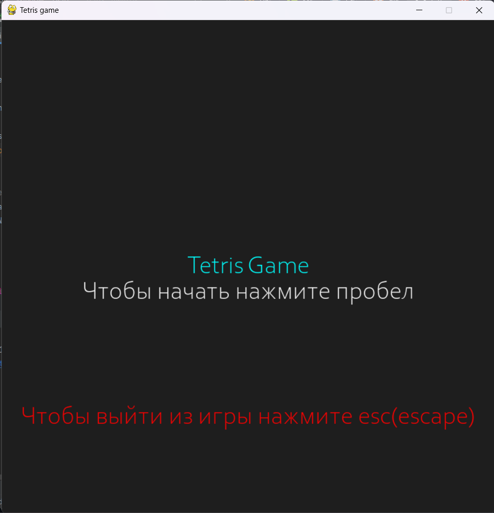
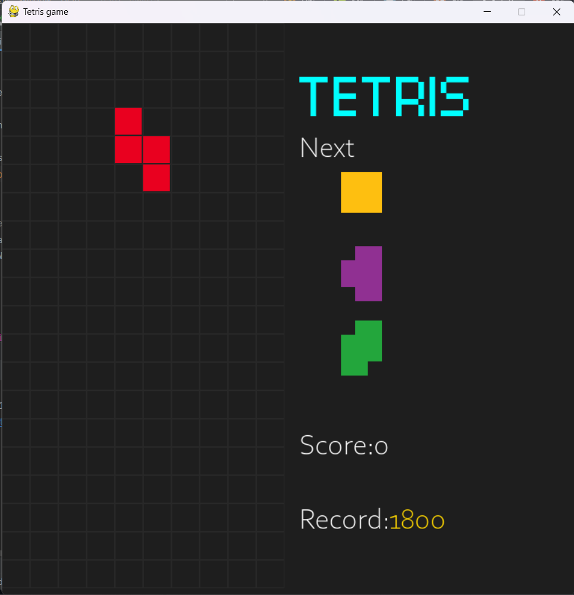
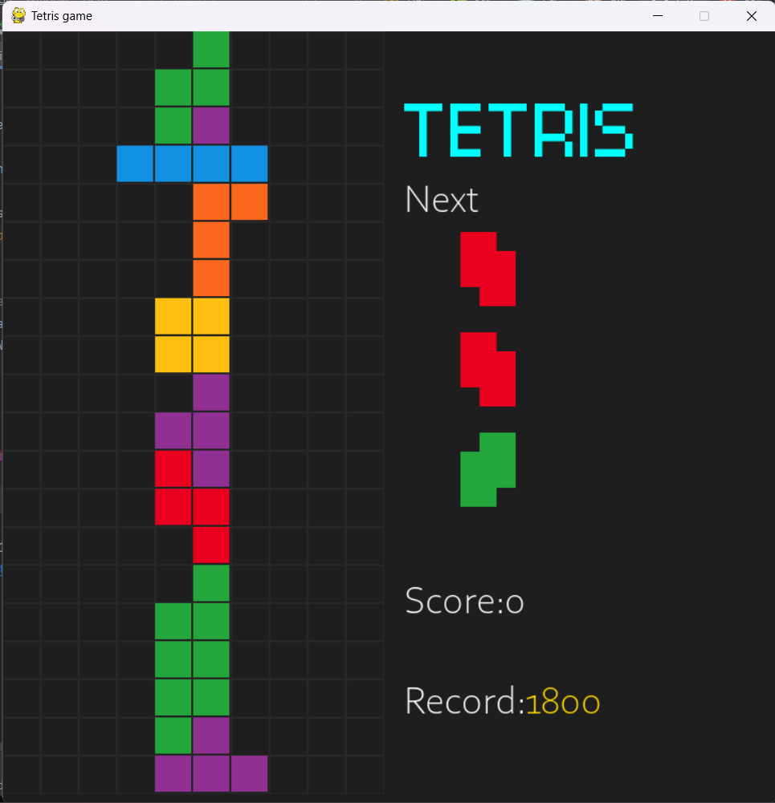

# Игра Tetris на Python с использованием Pygame
Этот проект представляет собой реализацию игры Tetris на языке Python с помощью библиотеки Pygame.

 { width: 200px; }

## Особенности

- Классическая игра Tetris с базовыми правилами.
- Отображение текущего счета и следующей фигуры.
- Управление фигурами с помощью клавиш стрелок.

  

